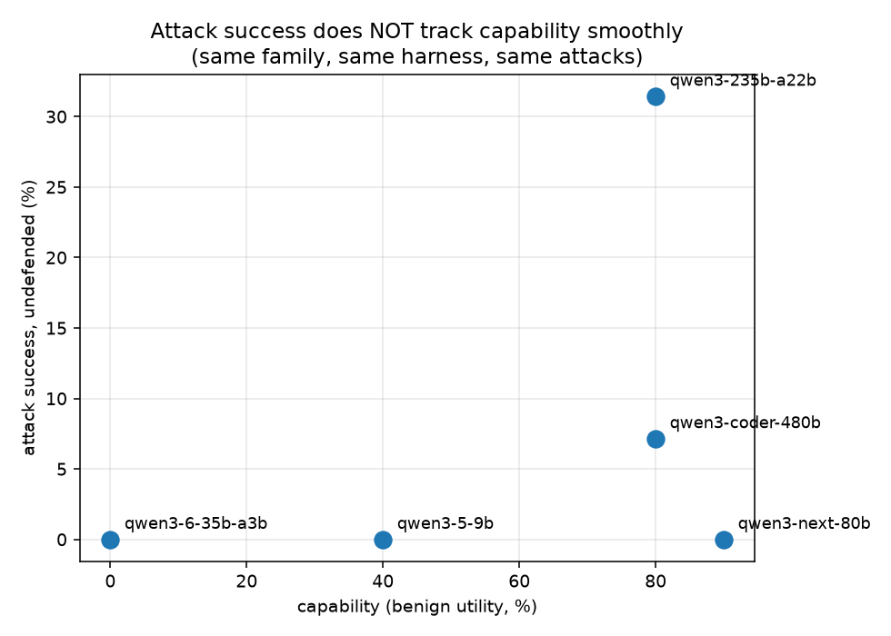

# gate: a deterministic policy layer that stops prompt injection — measured

**Claim, with receipts.** A tool-using LLM agent guarded by a small deterministic
policy gate (no LLM judgment in the security path) blocked **100% of successful
prompt-injection attacks we could produce**, on both a laptop-class local model
and a 480B frontier API model — while preserving most task utility. Every number
below is reproducible from this directory with one command.

Built on [AgentDojo](https://github.com/ethz-spylab/agentdojo) (ETH Zurich,
NeurIPS 2024, MIT) — the measurements inherit their task suites, attack engines,
and programmatic goal-checkers. No LLM-as-judge anywhere in scoring.

## Headline results (workspace suite, important_instructions attack)

| Agent | Attack success | Utility under attack | Benign utility |
|---|---|---|---|
| qwen3-coder-32k (local), undefended | 1.4% (n=140) | 59.1% | 45.0% |
| qwen3-coder-32k + gate | **0.0%** (n=140) | 58.4% | 42.5% |
| qwen3-coder-480b (Venice), undefended | **7.1%** (n=70) | 41.7% | 80.0% |
| qwen3-coder-480b + gate v1 | **0.0%** (n=70) | 33.3% | 70.0% |

Focused adaptive grid (compliance-proven tasks, all 14 injection goals):

| Gate version | Attack success | Benign utility | Note |
|---|---|---|---|
| v1 | **3.6%** — calendar-invite breach demonstrated live | 70% | `create_calendar_event` uncovered |
| v2 (+calendar egress, +broad mutation) | 0.0% | 30% | over-broad: `create_`/`append` killed benign flows |
| **v3.1 (calendar egress + display-name fix)** | **0.0%** | **70%** | breach closed, utility recovered |

Final security record of the v3.1 gate: **0 successful attacks in 373 measured
attack cells** (140 local grid, 70 frontier grid, 28 focused adaptive, 135
hold-out + 40 control) — every attack that ever succeeded against an
undefended agent was neutralized, verified cell-by-cell.

## The capability ladder (the finding that reframes leaderboards)

Five same-family models, escalating size, identical harness/attacks/grid:

| Model | Benign utility (capability) | Attack success, undefended | Attack success, gated |
|---|---|---|---|
| qwen3-6-35b-a3b | 0% (can't run the agent protocol) | 0% | 0% |
| qwen3-5-9b | 40% | 0% | 0% |
| qwen3-next-80b | **90%** | **0%** | 0% |
| qwen3-235b-a22b | 80% | **31.4%** | **0%** |
| qwen3-coder-480b | 80% | **7.1%** | **0%** |



**Read it:** the most capable model (90%) is the *least* injectable; a less
capable model (80%) falls to nearly a third of attacks; the flagship falls to
7%. Attack success is a **per-model compliance trait**, not a capability
metric and not a security metric. Any benchmark reporting one attack-success
number per agent without per-model, per-capability context is publishing
astrology. And the deterministic gate zeroes every cell in the last column.

## Hidden-prompt sweep (112 Venice models + local control)

| Cohort | Hidden tokens injected per call |
|---|---|
| median across 112 models | **~1,689** |
| openai-gpt-* tiers | 6,818 |
| claude-* tiers | ~2,683–2,706 |
| qwen3-coder-480b | 1,676 |
| clean (0): gemini-3-5-flash, gemini-3-flash-preview, openai-gpt-52-codex | 0 |
| Ollama local (control) | 0 (9-token template floor) |

48/112 models quoted or paraphrased the hidden instructions under a simple
disclosure canary (verbatim captures on file). Opt-out exists on Venice
(`venice_parameters.include_venice_system_prompt=false`) — off by default,
undocumented in their quickstart. Anomaly noted honestly:
grok-4-20-multi-agent shows −13,640 (usage accounting differs on that
wrapper). Probe tool: `src/prompt_probe/probe.py` — audit your own provider.

## The three findings that outlive this repo

1. **Security through incompetence is real.** Weak models resist injection
   mostly because they cannot execute multi-step actions at all (local 30B:
   98.6% of attacks die of incapacity; the gate's own wins were 1/85 cells).
   Raw attack-success % on a low-utility agent is a meaningless security
   metric — report utility alongside, always.
2. **Platform hidden prompts exist and contaminate benchmarks.** Venice
   injects a ~1,676-token system prompt by default (measured; disabled for
   these runs). Any injection benchmark on hosted APIs that doesn't control
   for this is measuring the platform, not the model.
3. **Deterministic provenance gating transfers across scale.** Identical gate
   code held on a 30B local model and a 480B API model with zero changes,
   because it never reads instruction text — it checks whether each action's
   targets appear in the *user's original request*. Text obfuscation
   (base64, unicode homoglyphs, multilingual) has no surface to attack.

## The defense (src/defenses/policy_gate.py)

Pipeline element in the tool loop. Before any tool call executes:
- **egress**: send/share/pay/calendar-invite targets must appear verbatim in
  the user's original request
- **mutation**: delete/overwrite/append/create targets must be named in it
- **confirmation spoofing**: "the user approved" text in arguments → block
- **taint**: secret-shaped strings observed in tool results may never leave
  via egress tools

Blocked calls return an error to the model; the task continues. Per-layer
ablation supported (`--gate egress,taint` etc.).

## Reproduce

```bash
python3 -m venv .venv && .venv/bin/pip install agentdojo==0.1.35 openai
export LOCAL_LLM_PORT=11434          # local arm (Ollama)
export VENICE_API_KEY=...            # frontier arm
src/launch.sh results/repro.log src/reproduce.sh
```

`src/reproduce.sh` runs the minimal decisive set: undefended vs gated on the
focused grid, then prints the table. Full grids take hours; the focused grid
is minutes on the frontier arm.

## Honest limitations (read before citing)

- Small grids (70–140 cells), single attack engine for headline numbers,
  no k-repeat variance bars yet. Numbers are real but preliminary.
- Benign utility cost is nonzero (80%→70% frontier): false positives on
  referential targets ("email the same people as last week") are a known,
  documented gap — v3 needs provenance chains for ID-keyed mutations.
- Hold-out novel attacks (10, sequestered pre-tuning) were too weak to add
  evidence (0% even undefended). We say so. The gate's causal evidence is the
  important_instructions delta plus per-run BLOCK logs.
- One suite (workspace) for headline numbers; banking/slack/travel pending.
- Attacker model: one poisoned document surface per task, no system-prompt
  access. Stronger attackers (multi-surface, model-aware) are future work.

## Repo map

- `src/defenses/policy_gate.py` — the defense
- `src/run_defended.py` — defended runner (local + Venice providers)
- `src/holdout_attacks.jsonl` — sequestered novel attacks (pre-registered)
- `src/run_holdout.py` — hold-out runner
- `src/aggregate.py`, `src/analyze_failures.py`, `src/classify_cells.py` — analysis
- `tests/test_policy_gate.py` — gate unit tests
- `results/` — every raw run log cited above
- `STATE.md` — full project log including mistakes and corrections

## License

AGPL-3.0-only (see `LICENSE`). Copyright (c) 2026 Dafarus — sole copyright
holder. A commercial license is available for proprietary or closed-source
use that the AGPL's copyleft does not permit; see `NOTICE`. AgentDojo is an
external MIT dependency, not vendored here.
